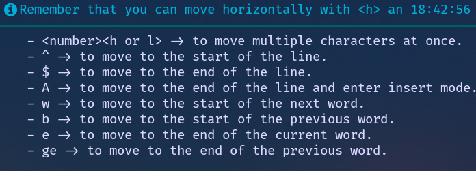

# Use the f* motions

A tiny Neovim plugin that nudges you to **use the f\*\*\*ing motions** instead
of mashing the arrow keys. When it catches you holding down the same arrow
key, it pops up a friendly little notification reminding you
that vim has, you know, motions.

## Caught in the act

This is roughly what happens after you press `<Down>` one too many times:



Rude? A little. Effective? Surprisingly, yes.

## Features

- Detects repeated `<Up>`/`<Down>` presses and reminds you about vertical motions
  (`j`, `k`, `{`, `}`, `%`, counts, ...).
- Detects repeated `<Left>`/`<Right>` presses and reminds you about horizontal
  motions (`h`, `l`, `w`, `b`, `e`, `ge`, `^`, `$`, `A`, ...).
- Cooldown between notifications so it doesn't turn into a nag-fest.
- Toggle on/off at runtime when you really, really just want to hold an arrow
  key in peace.
- Fully configurable: messages, titles, repetition thresholds, cooldown,
  keymaps, etc.

## Installation

With [lazy.nvim](https://github.com/folke/lazy.nvim) — the bare minimum:

```lua
{
  'Chamartin3/usethefmotions.nvim',
  event = 'VeryLazy',
  opts = {},
}
```

That's it. The defaults are sensible, the plugin will start whining at you
as soon as you mash an arrow key five times in a row.

## Configuration

Every field below is optional. The snippet shows the defaults, override
whatever annoys you:

```lua
{
  'Chamartin3/usethefmotions.nvim',
  event = 'VeryLazy',
  ---@type usethefmotions.Config
  opts = {
    -- start enabled. set to false if you want to opt in manually with :UseTheFMotions toggle.
    enabled = true,

    -- how long to shut up between notifications, in milliseconds. defaults to 5 minutes.
    cooldown_ms = 5 * 60 * 1000,

    -- consecutive presses at which a reminder fires. can be a list or a set.
    --   list:  { 5, 10 }
    --   set:   { [5] = true, [10] = true }
    breakpoints = { 5, 10 },

    -- keymap that flips the plugin on/off. set to false to skip the mapping.
    toggle_keymap = '<leader>nm',

    -- override the body of the notifications.
    messages = {
      vertical = '...your own pep talk...',
      horizontal = '...your own pep talk...',
    },

    -- override the notification titles.
    titles = {
      vertical = 'Remember that you can move vertically with <j>, <k>',
      horizontal = 'Remember that you can move horizontally with <h> and <l>',
    },
  },
}
```

### Commands

- `:UseTheFMotions toggle` — flip it on or off.
- `:UseTheFMotions status` — tell me if it's currently nagging.

### Health check

```
:checkhealth usethefmotions
```
